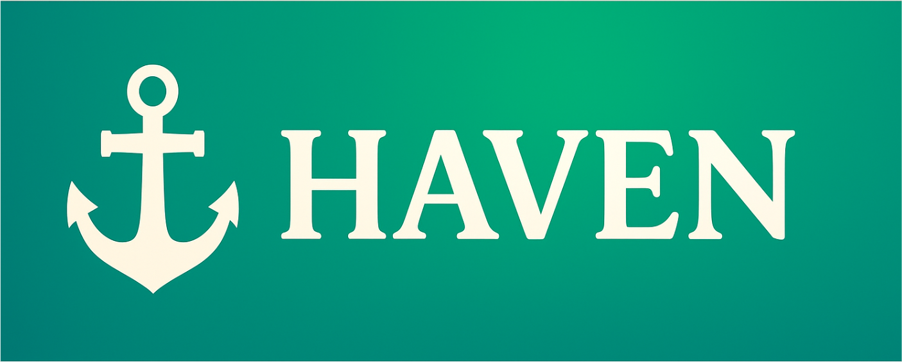
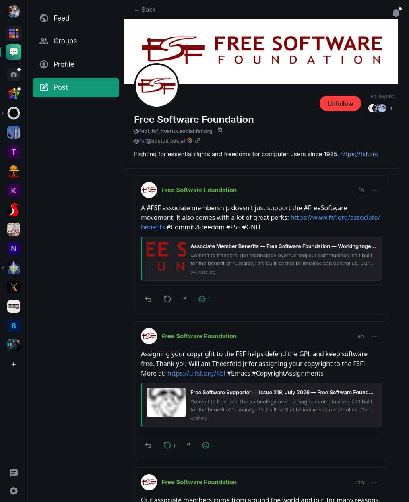

Try Haven at: https://app.haven.software

Haven is a fork of [Element Web](https://github.com/element-hq/element-web) built around four goals:

- **Social.** A Matrix-native profile, feed, and group experience, closer to a normal social
  network than a chat client. Part of the goal here is standardizing social media event types on
  Matrix itself, not just building a one-off client feature: see
  [MSC4501](https://github.com/matrix-org/matrix-spec-proposals/pull/4501), the spec proposal this
  is built on.
- **A more fun Element.** Prioritizing features the community wants rather than companies and governments.
- **Faster fixes.** Bugs and rough edges get patched here without waiting on the upstream release cycle.
- **Apps.** Element's own room list, spaces, and messaging stay intact. Haven adds a pluggable
  apps layer on top of them, and Social is the first app built on that layer, not a one-off
  bolt-on. More apps are meant to follow the same pattern.

## Social Features

- Create a profile on Matrix with full control over who can follow you
- Likes, reposts, quote posts, and emoji reacts on posts
- A Feed tab for viewing all your followers' posts in one big timeline
- Profiles are seen on your user card in regular chatrooms to help with discoverability
- Create groups to post together in one place

## Improvements to Element 
- Add banners to rooms that display in the top bar and the right panel
- You can finally [disable the spaces bar 🎉](https://github.com/element-hq/element-web/issues/18898)
- [Freeform text reactions](https://github.com/element-hq/element-web/issues/19409)
- You can set a [custom notification sound](https://github.com/element-hq/element-web/issues/9687) globally instead of just per-room
- Fixed a crash that could happen on startup under certain load orders.
- Fixed room list tooltips and avatars unnecessarily doing extra work for rows that are off
  screen, which was slowing down large room lists.

## Need posts?

A fresh Social feed starts empty. Have your homeserver admin set up
[matrix-appservice-activitypub](https://github.com/Haven-Organization/matrix-appservice-activitypub)
to bridge Fediverse activity into Matrix profiles. Following some active ActivityPub accounts will
fill your feed overnight.

You can also use the filter button on the feed to add any existing room, bridged or not.

## Build Quickstart

```
git clone https://github.com/Haven-Organization/haven-desktop.git
cd haven-desktop
./scripts/setup.sh
```

That's it. The script installs dependencies and drops in custom branding if you've set the
relevant environment variables. From here, pick web or desktop:

```
cd element-web/apps/web
pnpm dist          # web: static build in dist/
pnpm start         # web: dev server with hot reload

cd ../desktop
cp ../web/webapp/config.sample.json ../web/webapp/config.json  # bakes in a default (matrix.org) homeserver
pnpm exec asar pack ../web/webapp webapp.asar
pnpm build         # desktop: packaged app for your current OS and architecture
```

Desktop packages end up in `element-web/apps/desktop/dist/`.

By default `pnpm build` targets whatever OS and architecture you're building on. To target
something else, pass flags straight through to
[electron-builder](https://www.electron.build/cli):

```
pnpm build --linux deb
pnpm build --mac dmg
pnpm build --win nsis
pnpm build --arm64
```

## Configuration

See [docs/configure.md](docs/configure.md) for every `config.json` option Haven adds (disabling
apps, blockquote style, labs, the login/register footer links).

## MSC compliance

Where possible, Haven builds on real Matrix spec proposals (MSCs) instead of inventing one-off
client-only behavior, so the same data can be understood by other clients, bridges, and servers
too.

- [MSC4501](https://github.com/matrix-org/matrix-spec-proposals/pull/4501): the social media event
  types Social itself is built on, covering profile and group rooms, posts, likes, reposts, and
  replies.
- [MSC4133](https://github.com/matrix-org/matrix-spec-proposals/pull/4133): extensible profiles,
  used to link your Matrix account to your Social profile room.
- [MSC4221](https://github.com/matrix-org/matrix-spec-proposals/pull/4221): room banners, used for
  profile and group banner images (and shown in the room header bar for any room that sets one).
- [MSC3266](https://github.com/matrix-org/matrix-spec-proposals/pull/3266): room summaries, used to
  preview a public or knockable profile or group without joining it first.
- [MSC3827](https://github.com/matrix-org/matrix-spec-proposals/pull/3827): filtering rooms by
  type, used to tell a profile apart from a group in that same preview.
- [MSC4503](https://github.com/matrix-org/matrix-spec-proposals/pull/4503): external handles,
  used to link a non-Matrix identity (e.g. a Fediverse account) to your profile.

## License

Element Web itself remains under its own upstream license, contained within the `element-web`
directory. Haven's own code (`src/apps/`, `docs/`, `scripts/`, and this file's siblings) is
licensed under the terms in [LICENSE](LICENSE).
