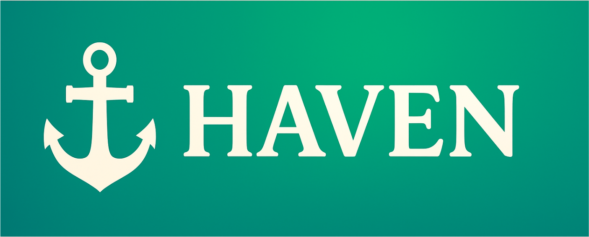
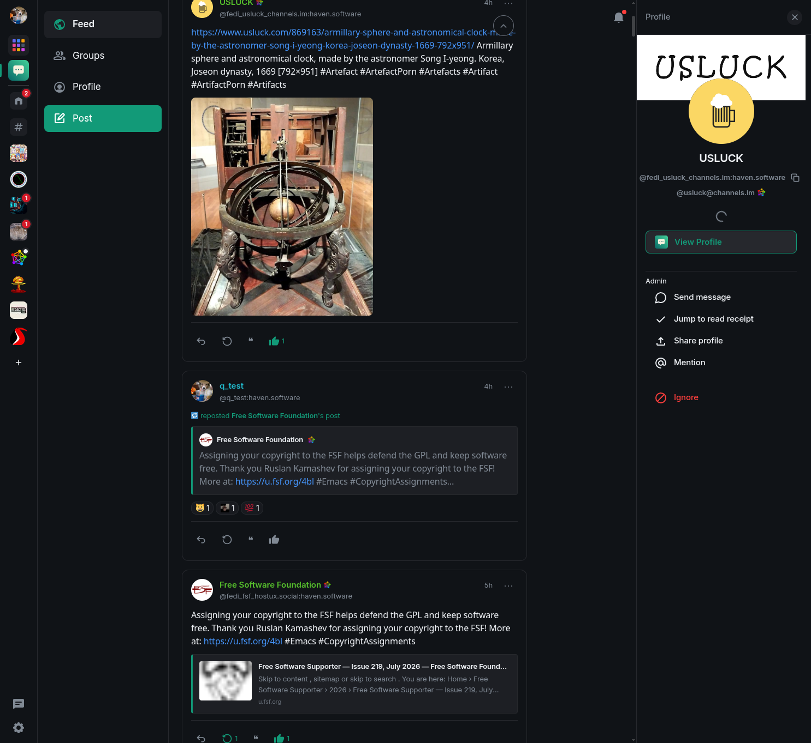
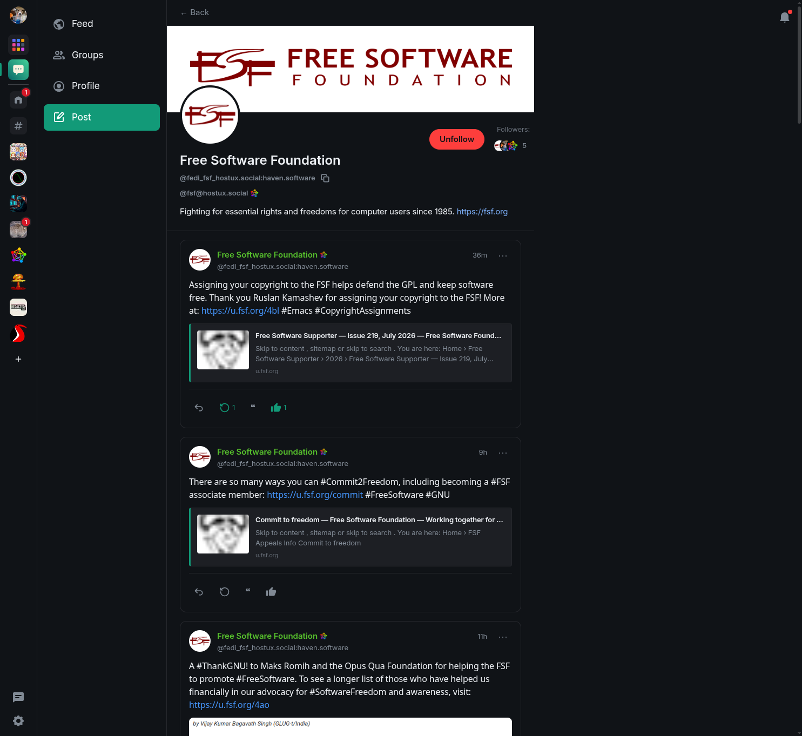

<p align="center">
  
</p>

<p align="center">
  
  
</p>

Try Haven at: https://app.haven.software

[](https://flathub.org/apps/software.haven.HavenDesktop)

Haven is a fork of [Element Web](https://github.com/element-hq/element-web) built around four goals:

- **Social.** A Matrix-native profile, feed, and group experience, closer to a normal social
  network than a chat client. Standardizing social media event types on
  Matrix. See
  [MSC4501](https://github.com/matrix-org/matrix-spec-proposals/pull/4501), the spec proposal this
  is built on.
- **A more fun Element.** Prioritizing features the community wants rather than companies and governments.
- **Faster fixes.** Bugs and rough edges get patched here without waiting on the upstream release cycle.
- **Apps.** Element's own room list, spaces, and messaging stay intact. Haven adds a pluggable
  apps layer on top of them, and Social is the first app built on that layer. More apps are meant to follow the same pattern.

## Social Features

- Create a profile on Matrix, with controls to make it private or public
- Likes, reposts, quote posts, and emoji reacts on posts
- A Feed tab for viewing posts from everyone you follow in one place
- Create groups to collaborate on topics
- Profiles are displayed on user cards in a room's right panel to help with discoverability.

## Improvements to Element

- [Custom emoji and sticker packs](https://github.com/element-hq/element-meta/issues/339) (including [emoji reactions](https://github.com/matrix-org/matrix-spec-proposals/pull/4027) and [pack references](https://github.com/matrix-org/matrix-spec-proposals/pull/4459))
- [Profile banners](https://github.com/matrix-org/matrix-spec-proposals/pull/4427). [Room & Space banners](https://github.com/matrix-org/matrix-spec-proposals/pull/4221) that display in the top bar. the right panel, and on space homepages.
- [Disable the spaces bar](https://github.com/element-hq/element-web/issues/18898)
- [Freeform text reactions](https://github.com/element-hq/element-web/issues/19409)
- Set a [custom notification sound](https://github.com/element-hq/element-web/issues/9687) globally instead of just per-room
- Speed up alt+(up|down) room navigation by not loading each room as you navigate.
- Customizable keyboard shortcuts
- Vim-like (H/J/K/L) navigation in lists and emoji/sticker picker
- Old room list re-added as an option
- Optimized room list rendering for large lists

## Got an empty Feed?

- If you're already in some Matrix rooms that would be a good fit, use the Filter button to add
  them to your feed. Messages will display as posts.
- Have your homeserver admin set up
  [matrix-appservice-activitypub](https://github.com/Haven-Organization/matrix-appservice-activitypub)
  to turn your Matrix server into a full ActivityPub instance. Following some active accounts will
  fill your feed overnight. Supports importing your existing follow list from other ActivityPub
  accounts.

## Build Quickstart

```
git clone https://github.com/Haven-Organization/haven-desktop.git
cd haven-desktop
./scripts/setup.sh
```

That's it. The script installs dependencies and drops in custom branding if you've set the
relevant environment variables. From here, pick web or desktop:

```
cd element-web/apps/web
pnpm dist          # web: static build in dist/
pnpm start         # web: dev server with hot reload

cd ../desktop
cp ../web/webapp/config.sample.json ../web/webapp/config.json  # bakes in a default (matrix.org) homeserver
pnpm exec asar pack ../web/webapp webapp.asar
pnpm build         # desktop: packaged app for your current OS and architecture
```

Desktop packages end up in `element-web/apps/desktop/dist/`.

By default `pnpm build` targets whatever OS and architecture you're building on. To target
something else, pass flags straight through to
[electron-builder](https://www.electron.build/cli):

```
pnpm build --linux deb
pnpm build --mac dmg
pnpm build --win nsis
pnpm build --arm64
```

See [docs/building.md](docs/building.md) for the full set of build flags, including web-side
options shared by both.

## Configuration

See [docs/configure.md](docs/configure.md) for every `config.json` option Haven adds (disabling
apps, blockquote style, labs, the login/register footer links).

## MSC compliance

Where possible, Haven builds on real Matrix spec proposals (MSCs), so the same data can be understood by other clients, bridges, and servers
too.

- [MSC4501](https://github.com/matrix-org/matrix-spec-proposals/pull/4501): The social media event
  types Social itself is built on, covering profile and group rooms, posts, likes, reposts, and
  replies.
- [MSC3639](https://github.com/matrix-org/matrix-spec-proposals/pull/3639): The original social media MSC that inspired this project. Because posts, groups and profiles currently share the same structure, Haven provides partial compatability with this MSC. See [Comparison to MSC3639](https://github.com/Haven-Organization/matrix-spec-proposals/blob/msc-social-media-pages/proposals/4501-rooms-as-social-media-pages.md#comparison-to-msc3639) for differences.
- [MSC3827](https://github.com/matrix-org/matrix-spec-proposals/pull/3827): filtering rooms by
  type, used to tell a profile apart from a group in that same preview.
- [MSC4027](https://github.com/matrix-org/matrix-spec-proposals/pull/4027): Custom emoji in reactions.
- [MSC4221](https://github.com/matrix-org/matrix-spec-proposals/pull/4221): Room banners, used for
  profile and group banner images (and shown in the room header bar for any room that sets one).
- [MSC4427](https://github.com/matrix-org/matrix-spec-proposals/pull/4427): Custom banners for user profiles
- [MSC4459](https://github.com/matrix-org/matrix-spec-proposals/pull/4459): Image pack references for advertising and finding what room a custom emoji/sticker came from.
- [MSC4503](https://github.com/matrix-org/matrix-spec-proposals/pull/4503): External handles,
  used to link a non-Matrix identity (e.g. a Fediverse account) to your profile.

## License

Element Web itself remains under its own upstream license, contained within the `element-web`
directory. Haven's own code (`src/apps/`, `docs/`, `scripts/`, and this file's siblings) is
licensed under the terms in [LICENSE](LICENSE).
